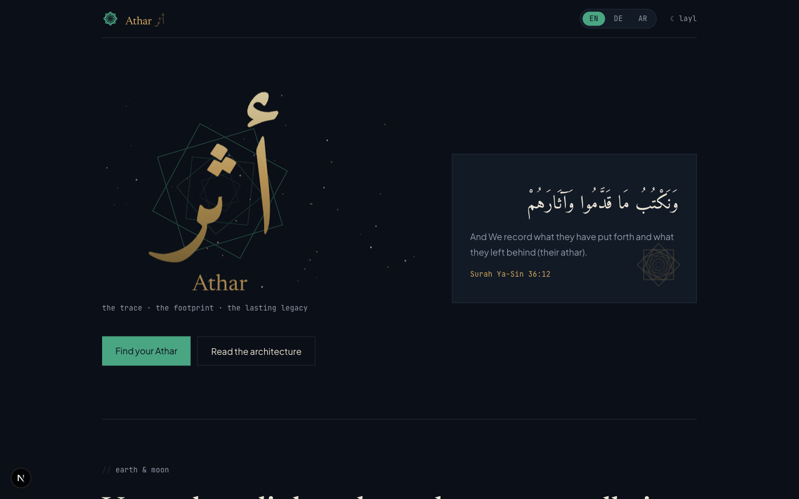
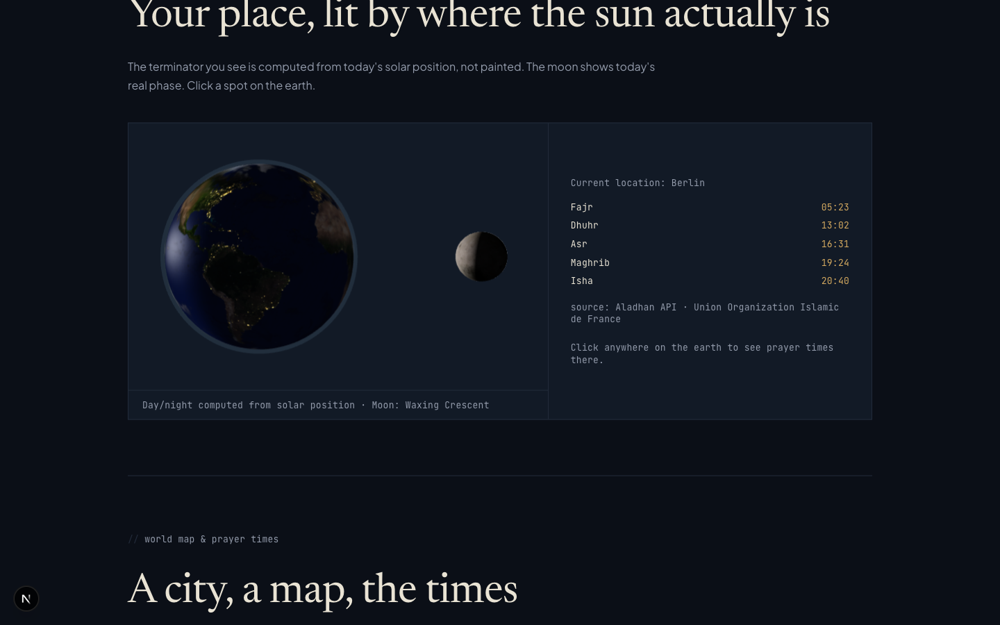
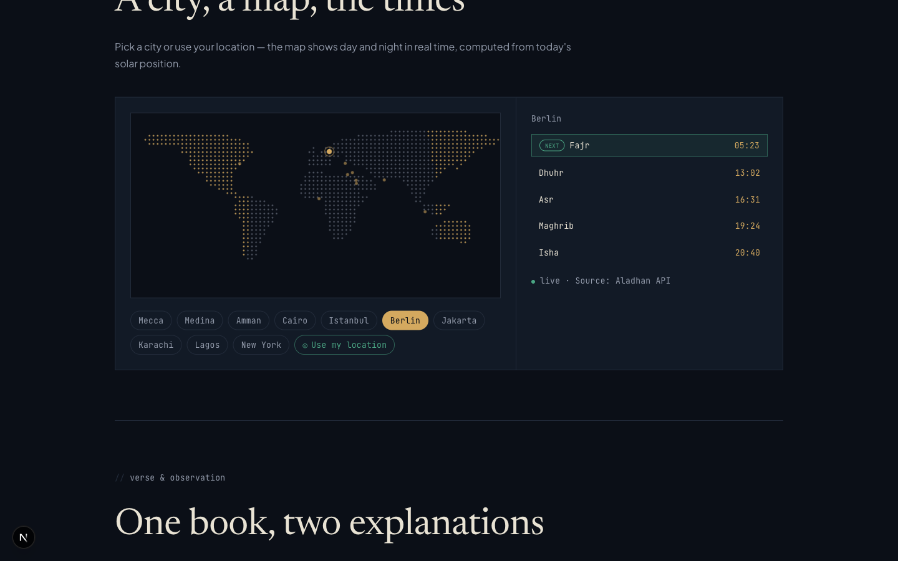
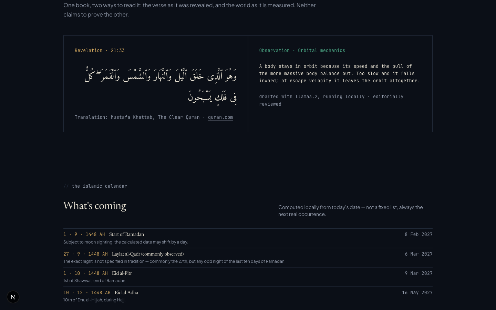

# Athar (أثر)

> *"And We record what they have put forth, and their traces (āthār)."*
> — Surah Ya-Sin (36:12)

**Athar** — the trace, the footprint, the mark that outlives you.

A 100% free, ad-free, privacy-respecting Islamic platform (web, Android,
iOS) plus a public API for developers — built as **Sadaqah Jariyah** (a
continuous charitable act) and fully open source.

  

---

## Why this exists

I spent years working on a project where code written by people I never met
kept running quietly, long after they'd moved on. Nobody remembered their
names. The code didn't care — it just kept working.

That question never left me: *what actually remains of the work, once
you're no longer in the room?*

Athar is my answer, built the only way I know how: not as a theory, but as
something running in a browser right now.

## What's actually live

The web frontend at [openathar.org](https://openathar.org) isn't a mockup —
these are real, working sections:

<table>
<tr>
<td width="50%">

**Your place, lit by where the sun actually is**

A real 3D earth with a day/night terminator computed from today's solar
position — not painted. The moon shows today's actual phase. Click anywhere
on earth to get prayer times for that spot.

</td>
<td width="50%">

</td>
</tr>
<tr>
<td width="50%">

**A city, a map, the times**

Pick a city — or use your own location — and see live prayer times,
computed locally in your browser by a TypeScript port of the shared
calculation engine (no external prayer-time API), with the next prayer
highlighted. The dotted world map itself shows day and night in real time.

</td>
<td width="50%">

</td>
</tr>
<tr>
<td width="50%">

**One book, two ways to read it**

The verse as it was revealed, and the world as it is measured — side by
side, neither claiming to prove the other. Quran text is sourced and cited,
never generated.

</td>
<td width="50%">

</td>
</tr>
</table>

Fully trilingual — **DE / EN / AR**, with proper RTL for Arabic (logical
CSS, real webfont typography, no image-based lettering).

## The campaign: "Leave your Athar"

Aimed at open-source contributors: contribute code as a lasting good deed.
This is for developers who'd rather leave a Sadaqah Jariyah through code
than through a donation. No commercial product, no tracking, no ads — that's
the actual difference from Muslim Pro, Athan Pro, AlMosaly and the rest, not
just marketing language.

## Repositories (GitHub org: `openathar`)

| Repo | Purpose | Status |
|---|---|---|
| [`athar-web`](https://github.com/openathar/athar-web) | Next.js frontend — everything shown above | **Live, deployed** |
| [`athan-core-java`](https://github.com/openathar/athan-core-java) | Core SDK (Java 25 / Maven) — prayer times, Qibla, Hijri calculation | **Published to Maven Central** (`org.openathar:athan-core:0.1.0`) |
| [`api-service`](https://github.com/openathar/api-service) | Spring Boot backend, public REST API (rate-limited, cached) | **V1 live at `api.openathar.org`** — prayer times, Qibla, Hijri |
| [`athar-mobile-app`](https://github.com/openathar/athar-mobile-app) | iOS/Android app (offline-first) | Scaffold — next in build order |

> **Status: Pre-Alpha.** The web frontend is real and running, the
> calculation engine is published as a library on Maven Central, and the
> public API serves its first endpoints. The mobile app is the remaining
> scaffold — deliberately last, because it only makes sense once the
> calculation engine is embeddable as a library. See
> [`docs/architecture.md`](docs/architecture.md) for exactly what's built
> versus what's planned, and why the order matters (the calculation engine
> has to exist before the API and the app can lean on it, instead of each
> reinventing it separately).

## Contributing

Contributors are welcome from MVP launch onward — that's the whole point of
"Leave your Athar". If you want to get involved earlier — architecture
feedback, religious content governance, licensing questions, translations —
open an issue right here.

Full system design & roadmap: [`docs/architecture.md`](docs/architecture.md).
Contributor notes for this superproject: [`AGENTS.md`](AGENTS.md).
